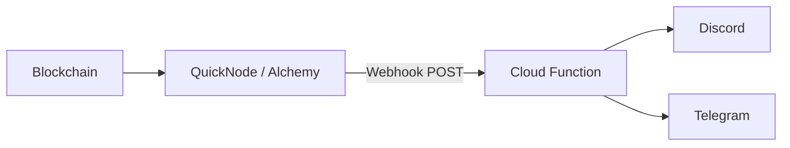
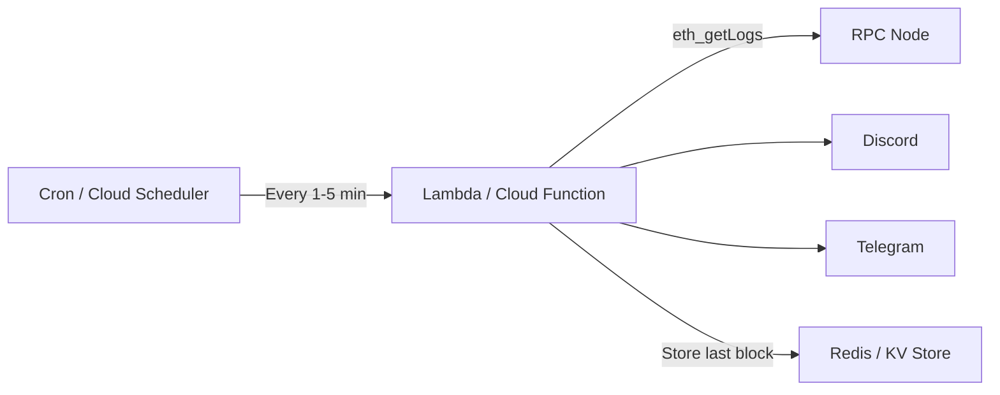
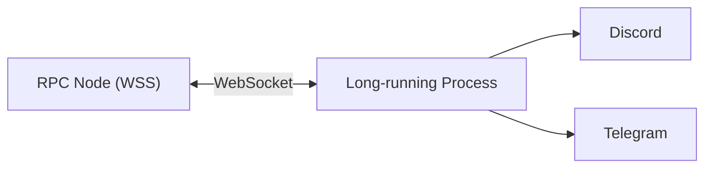
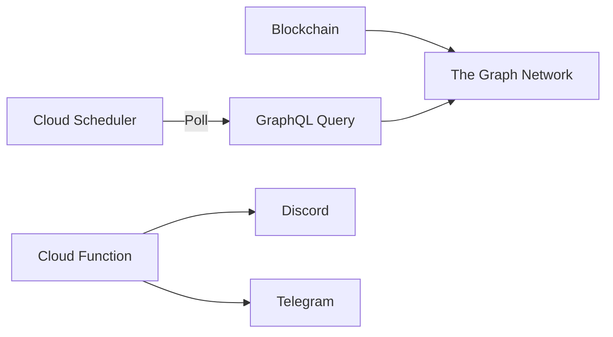
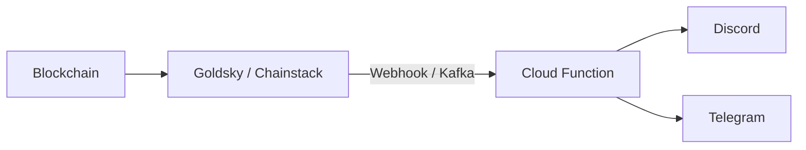

# Blockchain Event Monitor Architecture Options

## Requirements Recap

- Alert within **5 minutes** of a specific event on a specific contract
- **Single alert channel** (Slack, Discord, or Telegram)
- Keep architecture **as simple as possible**

---

## Architecture Options

### Option 1: Webhook-Based (Current Approach)

**How it works:** A blockchain infrastructure provider (QuickNode, Alchemy, Infura) monitors the chain and pushes matching events to your HTTP endpoint.



**Implementation:**

- Single serverless function (GCP Cloud Function / AWS Lambda / Cloudflare Worker)
- Provider handles all blockchain monitoring complexity
- You only write the notification logic

**Pros:**

- Lowest latency (typically **5-30 seconds**)
- Zero infrastructure to manage for blockchain monitoring
- Scales automatically
- No polling, no wasted compute
- Built-in filtering on the provider side

**Cons:**

- Vendor lock-in to the webhook provider
- Requires provider-specific signature validation
- Health monitoring needed (webhooks can silently fail)
- Cost scales with event volume (though governance events are rare)

Complexity: Low

---

### Option 2: Polling-Based

**How it works:** A scheduled job periodically queries an RPC node for new events using `eth_getLogs`.



**Implementation:**

- Scheduled function runs every 1-5 minutes
- Query `eth_getLogs` with block range since last check
- Store last processed block in a simple KV store (Redis, DynamoDB, Firestore)
- Send notifications for new events

**Pros:**

- No vendor lock-in (works with any RPC provider)
- Very simple to understand and debug
- Easy to replay/backfill historical events
- Can use free-tier RPC providers

**Cons:**

- Latency limited by poll interval (1-5 minutes)
- Wasted compute when no events occur
- Need to track state (last processed block)
- Can miss blocks if polling fails

Complexity: Low-Medium

---

### Option 3: WebSocket Subscription

**How it works:** Maintain a persistent WebSocket connection to an RPC node, subscribing to `logs` events.



**Implementation:**

- Long-running server with WebSocket connection
- Subscribe to specific contract logs using `eth_subscribe`
- React to events in real-time

**Pros:**

- Lowest possible latency (**sub-second**)
- No polling overhead
- True real-time streaming

**Cons:**

- Requires always-on infrastructure (VM, container, not serverless)
- WebSocket connections drop and need reconnection logic
- Need to handle missed events during reconnection
- More complex error handling
- Higher operational overhead

Complexity: Medium-High

---

### Option 4: The Graph / Subgraph

**How it works:** Deploy a subgraph to index events, then poll the subgraph API.



**Implementation:**

- Deploy a subgraph that indexes your contract events
- Poll the subgraph every few minutes
- Send notifications for new indexed events

**Pros:**

- Rich query capabilities (historical data, aggregations)
- Can query across multiple events/contracts easily
- Good for complex event relationships

**Cons:**

- Subgraph deployment and maintenance overhead
- Indexing lag adds latency (typically 30s - 2min)
- Overkill for simple "notify on event" use case
- Still requires polling the subgraph
- Cost for hosted service or curation on decentralized network

Complexity: High

---

### Option 5: Event Streaming Services (Goldsky, Chainstack Streams)

**How it works:** Use a dedicated event streaming service that pushes events via webhooks or to a message queue.



**Implementation:**

- Configure streams/mirrors in the provider console
- Receive events via webhook or consume from a queue

**Pros:**

- Similar benefits to webhooks
- Some offer guaranteed delivery (message queues)
- More flexibility in delivery mechanism

**Cons:**

- Newer services, less mature
- May require more setup (Kafka, etc.)
- Pricing can be complex

Complexity: Low-Medium

---

## Comparison Matrix

| Criteria           | Webhooks            | Polling         | WebSocket          | Subgraph              | Streaming        |
| ------------------ | ------------------- | --------------- | ------------------ | --------------------- | ---------------- |
| **Latency**        | 5-30s               | 1-5 min         | Sub-second         | 1-3 min               | 5-30s            |
| **Complexity**     | Low                 | Low-Med         | Med-High           | High                  | Low-Med          |
| **Infrastructure** | Serverless          | Serverless + KV | VM/Container       | Serverless + Subgraph | Serverless       |
| **Reliability**    | Needs health checks | Self-healing    | Reconnection logic | Provider manages      | Provider manages |
| **Cost**           | Per event           | Per poll        | Fixed + RPC        | Subgraph + polling    | Per event        |
| **Vendor lock-in** | High                | None            | None               | Medium                | High             |

---

## Recommendation

For your requirement (**alert within 5 minutes, simplest architecture**), I recommend:

### Primary: Webhook-Based (Option 1)

This is what you already have, and it's the right choice because:

1. **Meets latency requirement easily** - Events arrive in seconds, not minutes
2. **Minimal infrastructure** - One serverless function, no state management
3. **Provider handles complexity** - Block reorganizations, missed blocks, filtering
4. **Cost-effective for low-volume** - Governance events are rare (maybe a few per month)

### Alternative: Polling-Based (Option 2)

Consider this if you want to **eliminate vendor dependency**:

1. Simple cron job every 1-2 minutes
2. Store `lastProcessedBlock` in a simple KV (Upstash Redis free tier, or even a JSON file in cloud storage)
3. Works with any RPC provider (even free-tier Alchemy/Infura)

**Sample polling implementation (pseudocode):**

```typescript
// Runs every 1-2 minutes
async function checkForEvents() {
  const lastBlock =
    (await kv.get("lastProcessedBlock")) ?? (await getLatestBlock()) - 1000;
  const currentBlock = await getLatestBlock();

  const logs = await provider.getLogs({
    address: GOVERNOR_CONTRACT,
    topics: [EVENT_SIGNATURES],
    fromBlock: lastBlock + 1,
    toBlock: currentBlock,
  });

  for (const log of logs) {
    await sendNotification(parseEvent(log));
  }

  await kv.set("lastProcessedBlock", currentBlock);
}
```

---

## Simplification Opportunities vs Current Architecture

The current system has complexity that may not be needed:

| Current                              | Simplified                                       |
| ------------------------------------ | ------------------------------------------------ |
| Discord + Telegram                   | Single channel (e.g., Discord)                   |
| Event registry pattern               | Direct handler functions                         |
| Deduplication system                 | Skip (rare duplicates, idempotent notifications) |
| Health check webhooks + scheduler    | Simple uptime monitoring                         |
| GCP Cloud Functions + Secret Manager | Cloudflare Workers (simpler, built-in secrets)   |
| ~2000+ lines of TypeScript           | ~100-200 lines                                   |

---

## Minimal Viable Architecture

If starting from scratch today, the simplest version would be:

```text
QuickNode Webhook → Cloudflare Worker → Discord Webhook
```

- **~50-100 lines of code**
- **No database**
- **No complex infrastructure**
- **Free tier for low volume**

**Example implementation (Cloudflare Worker + Discord):**

```typescript
export default {
  async fetch(request: Request, env: Env): Promise<Response> {
    if (request.method !== "POST") return new Response("OK");

    // Validate QuickNode signature (optional but recommended)
    const signature = request.headers.get("x-qn-signature");
    if (
      !verifySignature(await request.clone().text(), signature, env.QN_SECRET)
    ) {
      return new Response("Unauthorized", { status: 401 });
    }

    const events = await request.json();

    for (const event of events) {
      const decoded = decodeEventLog({
        abi: GOVERNOR_ABI,
        data: event.data,
        topics: event.topics,
      });

      await fetch(env.DISCORD_WEBHOOK_URL, {
        method: "POST",
        headers: { "Content-Type": "application/json" },
        body: JSON.stringify({
          embeds: [
            {
              title: `🏛️ ${decoded.eventName}`,
              description: formatEventMessage(decoded),
              url: `https://celoscan.io/tx/${event.transactionHash}`,
            },
          ],
        }),
      });
    }

    return new Response("OK");
  },
};
```

### Alternative: Polling with Cloudflare Workers Cron

```typescript
export default {
  async scheduled(event: ScheduledEvent, env: Env): Promise<void> {
    const lastBlock = (await env.KV.get("lastBlock")) ?? "latest";
    const logs = await fetchLogs(env.RPC_URL, GOVERNOR_ADDRESS, lastBlock);

    for (const log of logs) {
      await sendDiscordNotification(env.DISCORD_WEBHOOK_URL, log);
    }

    await env.KV.put("lastBlock", logs.lastBlock);
  },
};
```

This uses Cloudflare Workers KV (free tier: 100k reads/day) and Cron Triggers (free tier: 10k/month).
