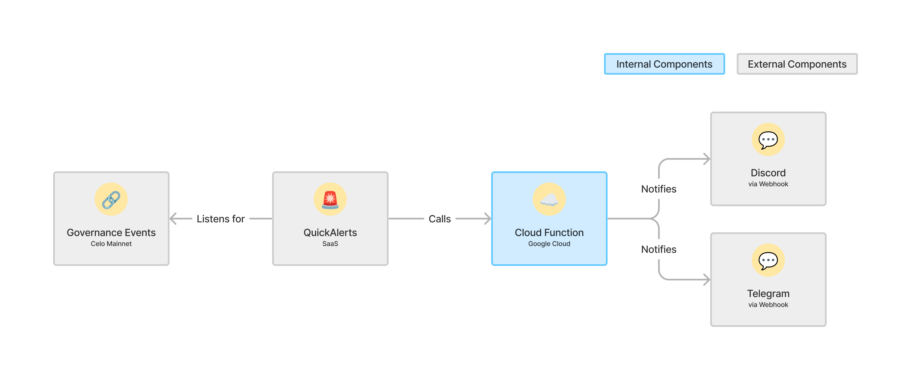

# 🐕 Governance Watchdog

<!-- markdown-link-check-disable -->

A system that monitors Mento Governance events on-chain and sends notifications about them to Discord and Telegram. Mento Devs can view the [full project spec in our Notion.](https://www.notion.so/mentolabs/Governance-Watchdog-d168a8110a53430a90e2f5ab65f103f5?pvs=4)

<!-- markdown-link-check-enable -->

- [Local Setup](#local-setup)
- [Running and testing the Cloud Function locally](#running-and-testing-the-cloud-function-locally)
- [Testing the Deployed Cloud Function](#testing-the-deployed-cloud-function)
- [Updating the Cloud Function](#updating-the-cloud-function)
- [Debugging Problems](#debugging-problems)
  - [View Logs](#view-logs)



## Local Setup

1. Install the `gcloud` CLI

   ```sh
   # For macOS
   brew install google-cloud-sdk

   # For other systems, see https://cloud.google.com/sdk/docs/install
   ```

1. Install `trunk` — one linter to rule them all

   ```sh
   # For macOS
   brew install trunk-io

   # For other systems, check https://docs.trunk.io/check/usage
   ```

   Optionally, you can also install the [Trunk VS Code Extension](https://marketplace.visualstudio.com/items?itemName=Trunk.io)

1. Install `jq` — used in a few shell scripts

   ```sh
   # For macOS
   brew install jq

   # For other systems, see https://jqlang.github.io/jq/
   ```

1. Install `terraform` — to deploy and manage the infra for this project

   ```sh
   # For macOS
   brew tap hashicorp/tap
   brew install hashicorp/tap/terraform

   # For other systems, see https://developer.hashicorp.com/terraform/install
   ```

1. Run terraform setup script

   ```sh
   # Checks required permissions, provisions terraform providers and modules, syncs terraform state
   ./bin/set-up-terraform.sh
   ```

1. Set your local `gcloud` project and cache project values used in shell scripts:

   ```sh
   # Will set the correct gcloud project in your terminal and populate a local cache with values frequently used in shell scripts
   npm run cache:clear
   ```

1. Create a `./infra/terraform.tfvars` file. This is like `.env` for Terraform:

   ```sh
   touch ./infra/terraform.tfvars
   # This file is `.gitignore`d to avoid accidentally leaking sensitive data
   ```

1. Add the following values to your `terraform.tfvars`. You can either follow the instructions in the comments to look up each value, or you can ask another dev to share his local `terraform.tfvars` with you

   ```hcl
   # Required for creating new GCP projects
   # Get it via `gcloud organizations list`
   org_id               = "<our-org-id>"

   # Required for creating new GCP projects
   # Get it via `gcloud billing accounts list` (pick the GmbH account)
   billing_account      = "<our-billing-account-id>"

   # The Discord Channel where we post mainnet notifications to
   # Get it via `gcloud secrets versions access latest --secret discord-webhook-url`
   # You need the "Secret Manager Secret Accessor" IAM role for this command to succeed
   discord_webhook_url  = "<discord-webhook-url>"

   # The Discord Channel where we post test notifications to
   # Get it via `gcloud secrets versions access latest --secret discord-test-webhook-url`
   # You need the "Secret Manager Secret Accessor" IAM role for this command to succeed
   discord_test_webhook_url  = "<discord-test-webhook-url>"

   # The Telegram Chat where we post mainnet notifications to
   # Get it via `terraform state show "google_cloudfunctions2_function.watchdog_notifications" | grep TELEGRAM_CHAT_ID | awk -F '= ' '{print $2}' | tr -d '"'`
   telegram_chat_id     = "<telegram-chat-id>"

   # The Telegram Chat where we post test notifications to
   # Get it via `terraform state show "google_cloudfunctions2_function.watchdog_notifications" | grep TELEGRAM_TEST_CHAT_ID | awk -F '= ' '{print $2}' | tr -d '"'`
   telegram_test_chat_id = "<telegram-test-chat-id>"

   # The Telegram bot used to receive and post notifications
   # NOTE: Make sure to also invite @MentoGovBot to the TG chat you want to post notifications to!
   # Get it via `gcloud secrets versions access latest --secret telegram-bot-token`
   telegram_bot_token   = "<telegram-bot-token>"

   # An auth token we use to be able to test deployed functions from our local machines
   # Get it via `gcloud secrets versions access latest --secret x-auth-token`
   x_auth_token         = "<x-auth-token>"

   # Required for Terraform to be able to create & destroy QuickAlerts
   # Get it from the [QuickNode dashboard](https://dashboard.quicknode.com/api-keys)
   quicknode_api_key    = "<quicknode-api-key>"

   # Get it via `echo "\nquicknode_security_token = \"$(gcloud secrets versions access latest --secret quicknode-security-token)\"" >> terraform.tfvars`
   quicknode_security_token = "<quicknode-security-token>"

   # Required to send on-call alerts to VictorOps
   # Get it from [our VictorOps](https://portal.victorops.com/dash/mento-labs-gmbh#/advanced/stackdriver) and clicking `Integrations` > `Stackdriver` and copying the URL. The routing key can be founder under the [`Settings`](https://portal.victorops.com/dash/mento-labs-gmbh#/routekeys) tab
   victorops_webhook_url   = "<victorops-webhook-url>/<victorops-routing-key>"
   ```

1. Auto-generate a local `.env` file by running `npm run generate:env` — we'll need this to run the cloud function locally

1. Verify that everything works

   ```sh
   # See if you can fetch logs of the watchdog cloud function
   npm run logs

   # See if you can manually trigger the deployed watchdog function with some dummy data
   # Make sure to delete the fake posts from the Telegram & Discord channels to not spam channel members too much
   npm run test:prod:ProposalCreated
   ```

## Running and testing the Cloud Function locally

- `npm install`
- `npm run dev` to start a local cloud function with hot-reload via nodemon
- `npm test:local:<EventName>` to call the local cloud function with a mocked payload for the respective event, this will send Telegram & Discord messages into the respective test channels

## Testing the Deployed Cloud Function

You can test the deployed cloud function manually by using the `src/<event-type>/fixture.json` which contains a similar payload to what a QuickAlert would send to the cloud function:

```sh
npm run test:prod:<EventName> # i.e. npm run test:prod:ProposalCreated
```

## Updating the Cloud Function

You have two options, using `terraform` or the `gcloud` cli. Both are perfectly fine to use.

1. Via `terraform` by running `npm run deploy`
   - How? The npm task will:
     - Call `terraform apply` which re-deploys the function with the latest code from your local machine (and all other infrastructure that may have changed since the last terraform deploy)
   - Pros
     - Keeps the terraform state clean
     - Same command for all changes, regardless of infra or cloud function code
   - Cons
     - Less familiar way of deploying cloud functions (if you're used to `gcloud functions deploy`)
     - Less log output
     - Slightly slower because `terraform apply` will always fetch the current state from the cloud storage bucket before deploying
2. Via `gcloud` by running `npm run deploy:function`
   - How? The npm task will:
     - Look up the service account used by the cloud function
     - Impersonate our shared Terraform Service Account to avoid individual permission issues
     - Call `gcloud functions deploy` with the correct parameters
   - Pros
     - Familiar way of deploying cloud functions
     - More log output making deployment failures slightly faster to debug
     - Slightly faster because we're skipping the terraform state lookup
   - Cons
     - Will lead to slightly inconsistent terraform state (because terraform is tracking the function source code and its version)
     - Different commands to remember when updating infra components vs cloud function source code
     - Will only work for updating a pre-existing cloud function's code, will fail for a first-time deploy

## Debugging Problems

### View Logs

For most problems, you'll likely want to check the cloud function logs first.

- `npm run logs` will print the latest 50 log entries into your local terminal for quick and easy access, followed by a URL leading to the full gcloud console logs

## Deploying from scratch

Check [DEPLOY_FROM_SCRATCH.md](./DEPLOY_FROM_SCRATCH.md)
